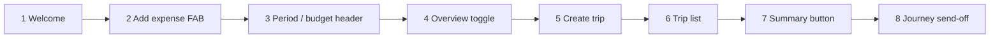

# Guided tour step inventory and first-run guidance mapping (2026)

Research for wayfinder map [#335](https://github.com/HaDuve/TravelCostNative/issues/335), ticket [#344](https://github.com/HaDuve/TravelCostNative/issues/344).

**Context:** Library research ([#338](https://github.com/HaDuve/TravelCostNative/issues/338)) recommends **removing the full guided tour**; first-run flow ([#339](https://github.com/HaDuve/TravelCostNative/issues/339)) lands users on **RecentExpenses** with a silent implicit budget. This doc inventories what the current 8-step tour covers, what it omits, and maps each surface to **first-run contextual guidance** vs **discover later**.

## Current tour mechanics

| Mechanism | Location | Detail |
|-----------|----------|--------|
| Provider | `App.tsx` | `TourGuideProvider` wraps root; custom tooltip in `Tourguide_Tooltip.tsx` |
| Trigger | `ProfileScreen.tsx` | Auto-starts when `userCtx.needsTour && canStart` (1–3s delay via `useInterval`) |
| Persistence | `util/tourUtil.ts` | Secure store key `hadTour`; skip/finish sets `needsTour → false` |
| Tab navigation | `ProfileScreen.tsx` `handleOnStepChange` | Manual `navigation.navigate(...)` per step order because inactive tabs unmount |
| Gating | `BlurPremium.tsx`, `ToastComponent.tsx`, `TripForm.tsx` | Premium blur and toasts suppressed while `needsTour` or `freshlyCreated` |
| Copy | `i18n/supportedLanguages.tsx` | `walk1`–`walk8` in EN/DE/ES/FR — travel/nomad framing |

Steps run in **zone order 1 → 8** (`rn-tourguide` sorts by `zone` prop).

## Step inventory

| Step | Zone | Tab / screen | UI target | English copy gist | Home-first fit |
|------|------|--------------|-----------|-------------------|----------------|
| 1 | 1 | Recent Expenses | Full-screen overlay (no wrapped control) | Welcome; “support you on your journey” | **Stale** — journey/travel promise belongs post-login, not as blocking overlay |
| 2 | 2 | Recent Expenses | `+` FAB (`AddExpenseButton`) | Add expenses; try the `+` now | **Core first-run** — only step that matches expense-first onboarding |
| 3 | 3 | Recent Expenses | Period dropdown / budget-remaining area (`maskOffset` targets header) | Daily vs monthly; tap top-right for money left | **Secondary first-run** — useful after first expense; too early on empty ledger |
| 4 | 4 | Overview | Graph/list toggle FAB | Category vs daily overview | **Discover later** — user has no categories to view yet |
| 5 | 5 | Profile | Globe icon → `ManageTrip` (create trip) | “Planning your next adventure”; create a new trip | **Contradicts #339** — implicit budget replaces mandatory create; copy should be “Add another budget” / “Name your budget”, not create trip |
| 6 | 6 | Profile | `TripList` | View trips; active trip highlighted green | **Discover later** — becomes My Budgets; irrelevant until user has 2+ budgets or joins |
| 7 | 7 | Profile | Summary list icon → multi-trip summary | Quick summary for one or more trips | **Discover later** — power feature; needs expense history |
| 8 | 8 | Recent Expenses | Full-screen overlay (no wrapped control) | “Enjoy your journey… explore the world” | **Remove** — travel-centric closing; no product value |

### Step flow diagram (current)

**Friction points:** Steps 1 and 8 block the whole screen without teaching a control. Steps 4–7 force tab switches before the user has data. Step 5 teaches trip creation that expense-first onboarding deliberately defers.

## Major features **not** covered by the tour

These exist in the app but never appear in `walk1`–`walk8` or `TourGuideZone` usage:

| Feature | Entry surface | First-run relevance |
|---------|---------------|---------------------|
| **Expense splits** | Expense form → split list | Discover later — needs multi-traveller context |
| **Settlements / split summary** | Profile / navigation to `SplitSummaryScreen` | Discover later |
| **Expense templates** | Long-press on `+` FAB | Discover later — empty-state tip after 3+ similar expenses optional |
| **GPT price / deal check** | Expense form / `ChatGPTDealScreen` | Discover later — premium-adjacent |
| **Join budget** | Profile / `TripForm` / `JoinTrip` | Discover later — My Budgets hub ([#339](https://github.com/HaDuve/TravelCostNative/issues/339)) |
| **Categories** | Settings / expense form | Discover later — defaults suffice at first run |
| **Budget amounts & dates** | `TripForm` | Deferred per [#339](https://github.com/HaDuve/TravelCostNative/issues/339) / [#341](https://github.com/HaDuve/TravelCostNative/issues/341) |
| **Travellers / sharing** | Trip settings | Discover later |
| **Premium / paywall** | `BlurPremium`, subscription screens | Not onboarding — avoid gating hints |
| **Settings & export** | Settings tab | Discover later |
| **Name implicit budget** | RecentExpenses banner ([#339](https://github.com/HaDuve/TravelCostNative/issues/339)) | **First-run** — not in tour today |

The old tour over-indexed on **multi-trip Profile mechanics** (steps 5–7) while skipping **join**, **splits**, and **templates** entirely.

## Recommendation: first-run vs discover later

Aligned with [#338](https://github.com/HaDuve/TravelCostNative/issues/338) (remove full tour) and [#339](https://github.com/HaDuve/TravelCostNative/issues/339) (expense-first).

### First-run contextual guidance (no multi-step spotlight)

| Surface | Replaces tour step | Pattern |
|---------|-------------------|---------|
| **Recent Expenses empty state** | walk1 + walk2 | Inline empty state: “Track what you spend” + primary **Add expense** CTA (no overlay) |
| **Name-your-budget banner** | *(new, #339)* | Dismissible banner on Recent Expenses — not a tour step |
| **Period / budget remaining** | walk3 (optional) | **After first expense only:** one-time inline hint on period control or budget chip; dismiss on tap |
| **Implicit budget row label** | walk5/6 partial | “Your budget” in My Budgets — persistent, not a coach mark |

**Do not** auto-navigate across tabs on first login. User stays on Recent Expenses until they choose another tab.

### Discover later (empty states, Settings tips, or in-context first visit)

| Surface | Former tour step | Suggested pattern |
|---------|------------------|-------------------|
| Overview tab | walk4 | Empty state: “Add expenses to see breakdowns” when chart/list empty |
| My Budgets / second budget | walk5, walk6 | Section empty state + “Add another budget” / “Join budget” when user opens Profile |
| Multi-trip summary | walk7 | Tooltip or Settings → Tips entry; no auto-show |
| Splits & settlements | *(absent)* | Empty state on Split Summary when shared budget has splittable expenses |
| Templates | *(absent)* | Optional hint on long-press `+` after user adds 5+ expenses (analytics-gated) |
| Join budget | *(absent)* | My Budgets hub CTA ([#339](https://github.com/HaDuve/TravelCostNative/issues/339)) |
| GPT price check | *(absent)* | Premium feature card in Settings or expense form “?” — never first-run |

### Remove without replacement

| Item | Reason |
|------|--------|
| walk1 welcome overlay | Blocking; copy is travel-centric |
| walk8 send-off overlay | No instructional value |
| Auto-start from `ProfileScreen` | Wrong tab for expense-first landing |
| `stepChange` tab navigation glue | Only needed for multi-step tour |
| `needsTour` gating in `BlurPremium` / toasts | Retire with tour removal |

### Optional micro-spotlight (only if product overrides “no tour”)

If a single spotlight moment is kept ([#338](https://github.com/HaDuve/TravelCostNative/issues/338) fallback): **zone 2 only** (`+` FAB on Recent Expenses), 1 step, `@wrack/react-native-tour-guide` or inline callout — not 8 steps across tabs.

## Verdict for [#340](https://github.com/HaDuve/TravelCostNative/issues/340)

**Remove the full guided tour.** Salvage **one first-run idea** from the old inventory (add expense via `+`) as an **empty-state CTA**, not a spotlight sequence. Everything else in walk3–walk8 moves to **discover-later empty states** or is **dropped** (walk1, walk5 travel copy, walk8). No multi-step replacement library is justified unless product explicitly rejects this mapping.

## Implementation pointers (when executing)

See migration table in [`onboarding-tour-libraries-2026.md`](./onboarding-tour-libraries-2026.md). Additional copy work: deprecate `walk1`–`walk8`; add empty-state strings home-first aligned with [#336](https://github.com/HaDuve/TravelCostNative/issues/336) vocabulary (**Budget** in UI, **Trip** in code).

## Sources

- Code: `TourGuideZone` in `RecentExpenses.tsx`, `AddExpenseButton.tsx`, `OverviewScreen.tsx`, `ProfileScreen.tsx`
- Code: `handleOnStepChange` in `ProfileScreen.tsx` (step order 1–8)
- Code: `walk1`–`walk8` in `TravelCostApp/i18n/supportedLanguages.tsx` (English block)
- Prior research: [`onboarding-tour-libraries-2026.md`](./onboarding-tour-libraries-2026.md)
- Map decisions: [#335](https://github.com/HaDuve/TravelCostNative/issues/335) — [#338](https://github.com/HaDuve/TravelCostNative/issues/338), [#339](https://github.com/HaDuve/TravelCostNative/issues/339)
